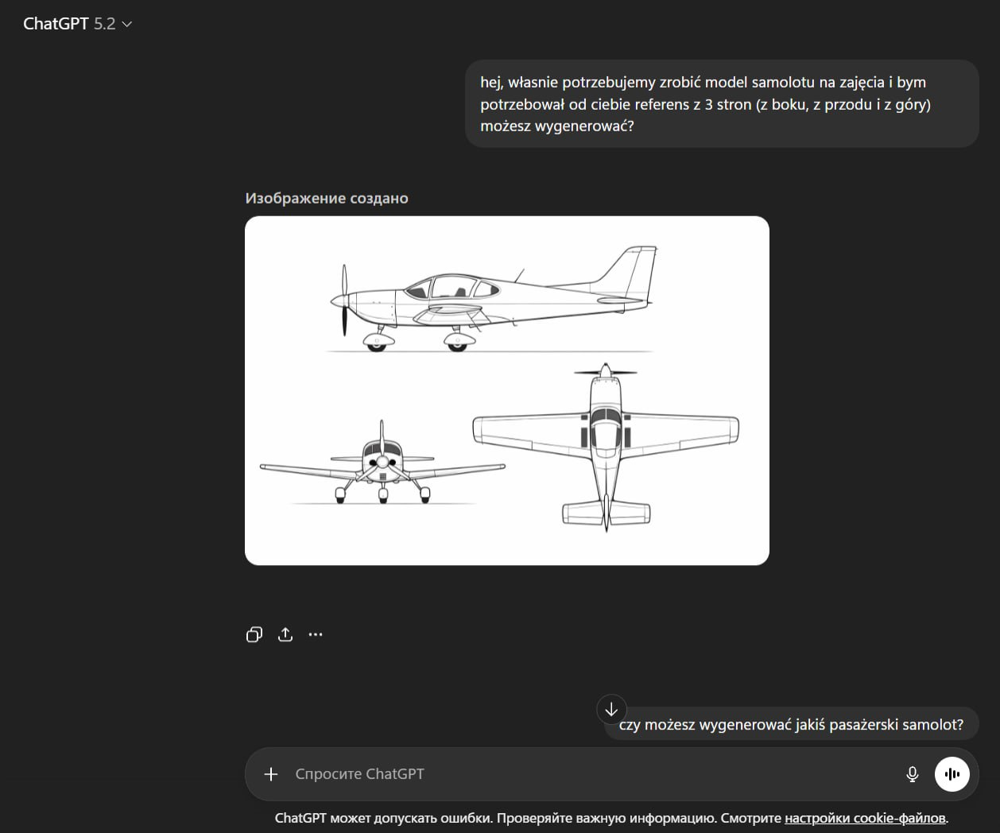
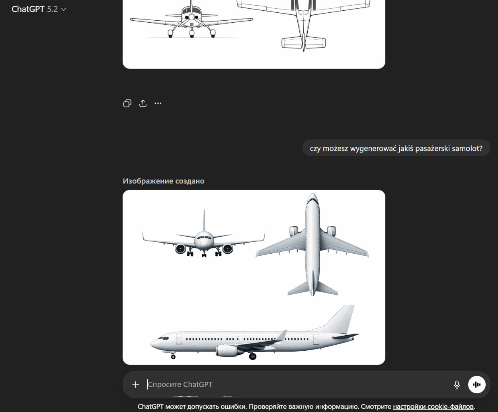

# Raport: Wykorzystanie asystentów AI w procesie projektowym

## 1. Skład zespołu projektowego
* **Ivan Berezka**
* **Mikita Tsarkovich**
* **Daniil Yakaulev**

## 2. Wstęp i charakterystyka współpracy z AI
Podczas realizacji projektu „Nowoczesny Samolot Pasażerski”, nasz zespół aktywnie zintegrował proces modelowania 3D z zaawansowanymi narzędziami sztucznej inteligencji – **Gemini** oraz **ChatGPT**. Wykorzystanie AI nie ograniczało się jedynie do prostych zapytań, lecz stanowiło fundament naszej strategii rozwiązywania problemów (troubleshooting) i optymalizacji pracy.

Sztuczna inteligencja pełniła rolę wirtualnego mentora i konsultanta technicznego, co przyniosło następujące korzyści:
* **Skrócenie krzywej uczenia się:** Zamiast tracić czas na wielogodzinne przeszukiwanie dokumentacji Blendera, otrzymywaliśmy precyzyjne instrukcje dotyczące konkretnych narzędzi (np. Knife Project czy Parenting).
* **Zarządzanie topologią:** AI pomogło nam utrzymać czystą siatkę (mesh) w stylu low-poly, co jest kluczowe dla wydajności modeli 3D.
* **Wsparcie wizualne i edukacyjne:** Modele AI selekcjonowały dla nas najlepsze materiały źródłowe na YouTube, co pozwoliło na naukę dobrych praktyk bezpośrednio od profesjonalistów.
* **Efektywność zespołowa:** Dzięki AI szybko ustaliliśmy workflow integracji plików (Parent-Child), co zapobiegło błędom przy łączeniu naszych niezależnie tworzonych komponentów.

## 3. Wykorzystanie AI do generowania i analizy referencji
Praca nad modelem 3D wymaga precyzyjnych rzutów (blueprintów). Wykorzystaliśmy **ChatGPT** do analizy kluczowych cech aerodynamicznych oraz wygenerowania spójnego zestawu referencji wizualnych. Pozwoliło to naszemu zespołowi pracować na jednym, uniwersalnym wzorcu nowoczesnego odrzutowca, zapewniając spójność proporcji między kadłubem, skrzydłami a silnikami.

Poniżej przedstawiamy dokumentację z procesu konsultacji dotyczących referencji oraz wygenerowane materiały:

---

## 4. Skonsolidowane logi z konsultacji technicznych

### Sekcja Ivana Berezki (Konsultacje z Gemini):

**Ja:** Cześć! Razem z dwoma kolegami z grupy robimy na zaliczenie model 3D samolotu pasażerskiego w Blenderze. Mamy już bazowy kadłub, ale teraz moja kolej na detale. Muszę dodać okna i drzwi. Próbowałem użyć Booleana, żeby wyciąć dziury, ale na okrągłym fuzelażu wszystko się gnie i cieniowanie wygląda fatalnie. Jak to ugryźć?

**Gemini:** Cześć! Boolean przy zaokrąglonych powierzchniach to najkrótsza droga do błędów w cieniowaniu. Na okrągłym kadłubie najlepiej użyć funkcji **Knife Project**. Pozwala ona rzutować płaski kształt na zakrzywioną powierzchnię. Narysuj obrys okna jako osobny obiekt (Plane), ustaw go przed samolotem i rzutuj na model. To zachowa gładkość bazy.

**Ja:** Próbowałem tego Knife Project, ale szczerze mówiąc, u mnie to w ogóle nie reaguje. Klikam w menu i nic się nie wycina, albo dostaję błąd, że nie znaleziono obiektów do cięcia. Masz jakiś konkretny filmik, który pokazuje to krok po kroku?

**Gemini:** Kolejność zaznaczania i tryb są tu kluczowe. Zobacz ten krótki tutorial: [Blender Knife Project tool quick guide]. Pamiętaj: najpierw zaznaczasz w Object Mode swój „nóż” (obrys okna), potem z Shiftem kadłub, wchodzisz w Edit Mode i dopiero wybierasz z menu na górze Mesh > Knife Project.

**Ja:** Obejrzałem, robię dokładnie tak samo i dalej nic. Wycina mi dziury w jakichś dziwnych miejscach albo dostaję komunikat "No mesh objects found to cut". Co jeszcze może być nie tak? Przecież ustawiam okno prosto przed samolotem.

**Gemini:** Knife Project działa w oparciu o to, co aktualnie widzi Twoja kamera w rzutni. Jeśli patrzysz pod kątem, cięcie będzie krzywe lub nie trafi w obiekt. Musisz przejść do widoku ortograficznego (klawisz Numpad 3 dla widoku z boku). Zobacz ten drugi, bardziej szczegółowy filmik, który wyjaśnia błędy z pozycjonowaniem kamery: [Why Knife Project is NOT working - Blender Tutorial]. Upewnij się, że Twój „nóż” jest idealnie przed kadłubem i patrzysz na nich prosto z boku.

**Ja:** Dobra, teraz w końcu załapało! Widok ortograficzny to był brakujący element. Ale teraz pojawił się kolejny problem – jak wyciąłem te otwory, to widać, że samolot jest pusty w środku. Wygląda to słabo. Muszę teraz modelować fotele i całe wnętrze? Nie dam rady tego zrobić, to za dużo roboty.

**Gemini:** Absolutnie nie modeluj środka. Skoro projekt ma być prosty, zrób **okna „na czarno”**. Zamiast wycinać dziury na wylot, po prostu zostaw te wycięte kształty jako część siatki kadłuba, ale przypisz im osobny, czarny materiał z niskim parametrem Roughness (ok. 0.1). To stworzy efekt przyciemnianych szyb i całkowicie ukryje pusty środek.

**Ja:** Dzięki, dobry pomysł. Zrobiłem czarny materiał i od razu model wygląda poważniej. Teraz biorę się za turbiny. Szczerze nie mam pojęcia, jak zacząć modelować taki silnik, żeby nie był tylko zwykłym klocem. Masz jakieś wideo o modelowaniu turbin z cylindrów?

**Gemini:** Turbinę najlepiej budować modułowo z cylindrów. Zobacz te tutoriale, pomogą Ci zrozumieć workflow: [Modeling a simple Jet Engine in Blender]. Zacznij od jednego cylindra na obudowę, użyj funkcji Inset (I) oraz Extrude (E) do środka, żeby stworzyć wlot. Dzięki temu turbina będzie miała głębię.

**Ja:** Wymodelowałem turbinę, ale mam problem z jej wygładzaniem. Jak włączam „Shade Smooth”, to cały silnik wygląda jak zgnieciona galareta, krawędzie, które powinny być ostre, są rozmyte. Co z tym zrobić?

**Gemini:** To problem z normalnymi. Musisz włączyć funkcję **Auto Smooth**. Wejdź w zakładkę Data Properties (zielony trójkąt), rozwiń sekcję Normals i zaznacz Auto Smooth (ustaw kąt na ok. 30 stopni). To sprawi, że płaskie powierzchnie turbiny zostaną płaskie, a tylko boki będą zaokrąglone.

**Ja:** Super, teraz silnik wygląda dobrze. Teraz muszę go skopiować pod drugie skrzydło. Próbowałem to zrobić ręcznie, ale nigdy nie trafiam w to samo miejsce. Jak to zrobić idealnie symetrycznie?

**Gemini:** Użyj modyfikatora **Mirror**. Wybierz turbinę. Dodaj modyfikator Mirror. W polu „Mirror Object” kliknij pipetę i zaznacz kadłub samolotu jako punkt odniesienia. Jeśli turbina wyskoczy w dziwnym miejscu, zaznacz ją i naciśnij **Ctrl + A -> All Transforms**. To zresetuje jej pozycję bazową i Mirror zadziała idealnie.

**Ja:** Spróbowałem, ale ta nowa turbina po drugiej stronie stała się przezroczysta, jakbym patrzył przez nią na wylot. Co się stało?

**Gemini:** To problem z Normalnymi (Normals), które Mirror czasem odwraca „na lewą stronę”. Zaznacz turbinę, wejdź w Edit Mode, zaznacz całą siatkę (klawisz A) i naciśnij **Alt + N -> Recalculate Outside**. To naprawi kierunek ścianek i turbina będzie widoczna poprawnie.

**Ja:** Pomogło, dzięki. Ostatnie co zostało mi zrobić to podwozie. Zrobiłem koła, ale mamy problem z integracją plików. Jak koledzy ruszają samolotem w swoim pliku głównym, to moje podwozie zostaje w punkcie zero. Muszę to wszystko łączyć w jedną siatkę (Join)?

**Gemini:** Nie używaj funkcji Join, bo stracisz kontrolę nad materiałami. Użyj **Parentingu**. Zaznacz wszystkie elementy podwozia i turbiny, na samym końcu zaznacz kadłub i naciśnij **Ctrl + P -> Object**. W ten sposób kadłub zostanie „rodzicem” – jak koledzy przesuną samolot, Twoje detale polecą razem z nim.

**Ja:** Dzięki! Wszystko działa i wygląda dokładnie tak, jak chcieliśmy.

---

### Sekcja Mikity Tsarkovicha (Konsultacje z Gemini):
**Ja:** Robię model samolotu w Blenderze. Odpowiadam za kadłub i przednią szybę. Od czego najlepiej zacząć modelowanie kadłuba?

**Gemini:** Najlepiej zacząć od prostego cylindra jako bazy. Ustaw około 24–32 verteksy, aby zachować odpowiednią ilość detalu. Następnie dopasuj proporcje na podstawie referencji — widok z boku i z góry będzie najważniejszy.

**Ja:** Jak poprawnie ustawić proporcje kadłuba?

**Gemini:** Wejdź w Edit Mode i użyj Scale (S) oraz Proportional Editing (O). Zwęż przód i tył, aby uzyskać aerodynamiczny kształt. Dodaj edge loopy (Ctrl+R), żeby lepiej kontrolować krzywizny. Możesz też obejrzeć poradniki na YouTube: „Blender Beginner Hard Surface Modeling” – Blender Guru oraz „Modeling a Jet Airplane in Blender” – CG Cookie.

**Ja:** Jak wymodelować przód samolotu, żeby wyglądał realistycznie?

**Gemini:** Dodaj więcej geometrii w przedniej części modelu. Użyj Subdivision Surface modifier, a następnie dodaj supporting edge loopy blisko krawędzi, aby zachować kontrolę nad kształtem. Pomocny może być poradnik: „Subdivision Surface Modeling Tips” – Josh Gambrell.

**Ja:** Modeluję teraz przednią szybę. Ma być matowa i nieprzezroczysta. Jak ustawić materiał?

**Gemini:** Dodaj nowy materiał z shaderem Principled BSDF. Ustaw Transmission na 0, aby szyba była nieprzezroczysta. Zwiększ Roughness do około 0.6–0.8, aby uzyskać efekt matowy. Możesz ustawić ciemnoszary kolor. Jeśli potrzebujesz dodatkowych informacji: „Blender Materials Beginner Guide” – Blender Guru.

**Ja:** Czy szybę należy oddzielić jako osobny obiekt?

**Gemini:** Tak. W Edit Mode zaznacz faces szyby i użyj **P → Selection**. Dzięki temu możesz niezależnie zarządzać materiałem oraz ustawieniami shadingu.

**Ja:** Pojawiają się problemy z cieniowaniem. Jak je poprawić?

**Gemini:** Użyj Shade Smooth, następnie włącz **Auto Smooth** w Object Data Properties (np. 30°). Sprawdź również, czy nie ma podwójnych verteksów — użyj **Merge by Distance**. Możesz obejrzeć: „Fix Shading Problems in Blender” – CG Cookie.

**Ja:** Jak poprawić realizm modelu?

**Gemini:** Dodaj delikatny Bevel na ostrych krawędziach. W rzeczywistości krawędzie nie są idealnie ostre. Użyj HDRI w ustawieniach World, aby uzyskać bardziej realistyczne oświetlenie. Polecany poradnik: „Lighting in Blender for Beginners” – Blender Guru.

**Ja:** Na tej podstawie dokończę model kadłuba i przednią szybę.

**Gemini:** Powodzenia przy dalszej pracy nad projektem!

---

### Sekcja Daniila Yakauleva (Konsultacje z ChatGPT):
**Ja:** Na bazie tej referencji chcę zacząć od skrzydeł, ale nie wiem, czy od razu robić je grube, czy najpierw płaskie.

**ChatGPT:** Najlepiej zacząć od płaskiej geometrii widzianej z góry, a dopiero później dodać grubość. Łatwiej wtedy kontrolować kształt i proporcje.

**Ja:** Okej, zrobiłem jedno skrzydło, ale cały czas mam wrażenie, że kąt nachylenia jest trochę dziwny.

**ChatGPT:** To normalne na tym etapie. Sprawdź skrzydło jednocześnie w widoku z góry i z boku (widok ortograficzny). Drobna korekta rotacji często wystarcza. Zobacz: [YouTube: Blender 3D Viewport Navigation and Orthographic Views].

**Ja:** Nie chcę robić drugiego skrzydła ręcznie, bo boję się, że coś się rozjedzie.

**ChatGPT:** W takiej sytuacji najlepiej użyć symetrii. Zrób jedno skrzydło i zastosuj modyfikator **Mirror**, wtedy oba będą identyczne. Jako obiekt odniesienia ustaw kadłub Mikity.

**Ja:** Skrzydła są już na miejscu, ale po włączeniu shade smooth wyglądają zbyt miękko, jakby były z gumy.

**ChatGPT:** Spróbuj włączyć **Auto Smooth** i ustawić odpowiedni kąt. To pozwoli zachować ostre krawędzie tam, gdzie są potrzebne. Jeśli to nie pomoże, sprawdź podwójne wierzchołki: [YouTube: Blender - How to fix Shading Issues (Merge by Distance)].

**Ja:** Teraz cały model wygląda trochę zbyt prosty. chciałbym dodać coś jeszcze, ale bez przesady.

**ChatGPT:** Możesz dodać kilka drobnych elementów technicznych na spodzie kadłuba, np. anteny albo małe obudowy. Nie muszą być bardzo szczegółowe – w low-poly liczy się umiar.

**Ja:** Dodałem parę takich elementów, ale boję się, że model stanie się za ciężki.

**ChatGPT:** Jeśli to są proste bryły i jest ich tylko kilka, nie wpłynie to znacząco na wydajność. Dopóki nie używasz Subdivision Surface z wysokim poziomem, wszystko będzie działać płynnie.

**Ja:** Okej, wizualnie wygląda lepiej. Teraz trzeba to wszystko połączyć z plikiem, który mają koledzy.

**ChatGPT:** Upewnij się, że wszystkie obiekty są poprawnie ustawione względem kadłuba i przypisane przez **Parent-Child (Ctrl+P)**. To ułatwi integrację i poruszanie całym modelem.

**Ja:** Po imporcie do wspólnego pliku wszystko działa, skrzydła i detale poruszają się razem z kadłubem.

**ChatGPT:** Super. W takim razie Twoja część modelu jest gotowa i można przejść do dalszej pracy zespołowej.
